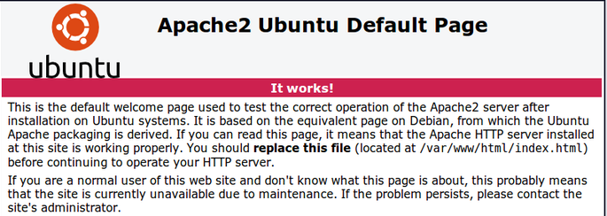

# INSTALLATION DE L'***ENVIRONNEMENT LAMP***

## CREATION D’UN UTILISATEUR AVEC PRIVILEGES ROOT
si vous avez déjà un utilisateur root, vous pouvez passer cette étape et commencer directement l'installation d'Apache2

passer en superutilisateur
```
sudo su
```
créer un nouvel utilisateur
```
adduser NomDuNouveauUser
```
donner les droits root
```
gpasswd –a NomDuNouveauUser sudo
```
changer d'utilisateur
```
su NomDuNouveauUser
```

## INSTALLATION D’APACHE
```
apt-get update && apt-get install apache2
```
verifier : ouvrez un navigateur, et entrer "localhost" dans l'URL, le navigateur doit afficher ceci :  




## INSTALLATION DE PHP 7.2
```
apt-get install python-software-properties
```
```
add-apt-repository ppa:ondrej/php
```
```
sudo apt-get update && apt-get install php7.2
```
```
apt-get install php-pear php7.2-curl php7.2-dev php7.2-gd php7.2-mbstring php7.2-zip php7.2-mysql php7.2-xml
```

## INSTALLATION DE MySQL
```
sudo apt-get install mysql-server php7.2-mysql
```
choisir un mot de passe pour MySQL

## INSTALLATION DE PHPMYADMIN
```
sudo apt-get install phpmyadmin
```
- "Veuillez choisir le serveur web à reconfigurer  automatiquement pour exécuter phpMyAdmin  
Serveur web à reconfigurer automatiquement : " 
    - choisir : ***apache2***
    
- Faut-il configurer la base de données de phpmyadmin avec dbconfig-common ? 
    - Oui

- indiquer un mot de passe

## INSTALLATION DE NODE JS
```
curl -sL https://deb.nodesource.com/setup_8.x | sudo -E bash -
sudo apt-get install -y nodejs
```
## INSTALLATION DE YARN (installe la 1.7.0)
```
curl -sS https://dl.yarnpkg.com/debian/pubkey.gpg | sudo apt-key add -
echo "deb https://dl.yarnpkg.com/debian/ stable main" | sudo tee /etc/apt/sources.list.d/yarn.list
```
```
sudo apt-get update && sudo apt-get install yarn
```

## INSTALLATION DE COMPOSER
```
php -r "copy('https://getcomposer.org/installer', 'composer-setup.php');"

php -r "if (hash_file('SHA384', 'composer-setup.php') === '544e09ee996cdf60ece3804abc52599c22b1f40f4323403c44d44fdfdd586475ca9813a858088ffbc1f233e9b180f061') { echo 'Installer verified'; } else { echo 'Installer corrupt'; unlink('composer-setup.php'); } echo PHP_EOL;"

php composer-setup.php

php -r "unlink('composer-setup.php');"
```
puis installation globale
```
sudo mv composer.phar /usr/local/bin/composer
```
---
# préparation du  dossier CLICK-N-SEND
se rendre à la racine du dossier Click-n-send
```
cd /var/www/html/CheminDuDossier/Click-n-send
```
```
yarn
```
```
yarn start
```
```
composer install
```


---
# Tuto passage sous apache2 : 
- tout d abord executer cette commande dans le repo du projet : 

```
composer require symfony/apache-pack
```

Une question va etre posé pendant l instalation :   
```
repondre : yes
```
(si la question n est pas posée , exécuter :
```PHP
composer remove symfony/apache-pack 
// puis de nouveau : 
composer require symfony/apache-pack
```

-  si la commande a bien fonctionné, un fichier ***.htaccess*** est apparus dans public.  
Remplacer son contenu par : 
```
RewriteEngine On
RewriteBase /
RewriteCond %{REQUEST_FILENAME} !-f
RewriteCond %{REQUEST_FILENAME} !-d
RewriteRule ^(.*)$ index.php?params=$1 [L,QSA]
```

- ensuite créer un virtual host, pour ce faire : 
    - ouvrir le fichier /etc/hosts 
```
sudo nano /etc/hosts
```
et ajouter votre VH (ex : ***127.0.0.1 clicknsend.local*** / ***192.168.xx.xx nomdemonsite.C0M*** )

- ensuite aller dans le dossier /etc/apache2/sites-available et créer un fichier de conf (pour mon exemple ***clicknsend.local.conf***)
```PHP
// aller dans le dossier
cd /etc/apache2/sites-available
sudo touch clicknsend.local.conf
```
- dans ce fichier créé, copier ceci (en adaptant bien sûr les données a votre VH) : 
```PHP     
sudo nano 
```

```PHP     
<VirtualHost *:80>
  ServerAdmin juriens.rodrigue@gmail.com
  DocumentRoot "/var/www/html/projet/Click-n-send/public/" //attention mettre le bon chemin de son dossier
  ServerName clicknsend.local
  ServerAlias www.clicknsend.local
</VirtualHost>
```
- ensuite dans la console taper :
```PHP
sudo a2ensite clicknsend.local //metter votre ServerName si ce n est pas clicknsend.local
```
- redemarrer apache : 
```
service apache2 restart
```

si le site n est pas accesible apres ca , utiliser cette commande :  
```PHP
sudo a2enmod rewrite
// puis redémarrer apache  : 
service apache2 restart
```

- installer _WkHtmlToPdf _ 
### ***ATTENTION*** il faut choisir la version compatible avec l'OS qui fait tourner votre serveur   
https://wkhtmltopdf.org/downloads.html

puis vérifier que le fichier est bien installé sur le chemin ***/usr/local/bin/whhtmltopdf***

- installer _knp-snappy-bundle_
```
composer require knplabs/knp-snappy-bundle
```

- installer _swiftmailer-bundle_
```
composer require symfony/swiftmailer-bundle
```

dev-mo : méthode bourrine en cas de soucis  
chmod 777 -R /var/www/html/apothéose/Click-n-send/